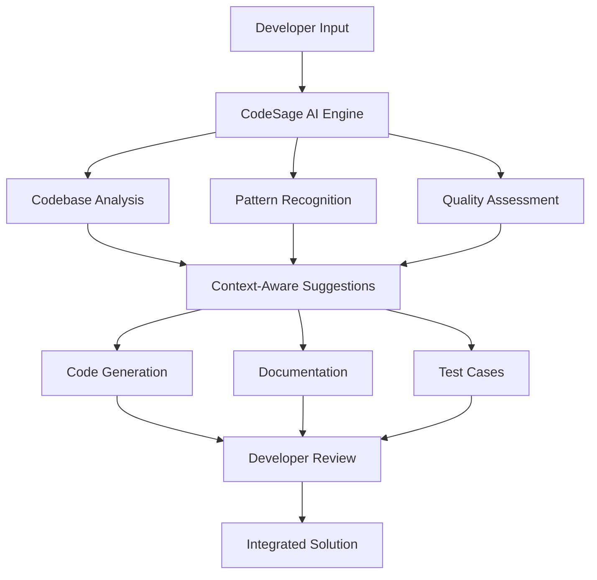

# CodeSage AI Innovation Proposal

## Problem Statement

Current AI coding assistants lack contextual understanding of entire codebases, leading to inconsistent suggestions and integration challenges. Developers spend 60% of time on maintenance rather than innovation.

## Proposed Solution: CodeSage AI

### Context-Aware Generation
Understands entire codebase architecture and provides suggestions that align with existing patterns and conventions.

### Multi-Modal Intelligence
Integrates code, documentation, and issue tracking for comprehensive development assistance.

### Learning Capabilities
Adapts to team coding patterns and preferences over time.

### Quality Assurance
Automated testing and security vulnerability detection built into the workflow.

## Workflow Diagram

## Expected Impact

- **Development Speed**: 40% faster feature delivery
- **Code Quality**: 85% reduction in bugs and security issues
- **Team Productivity**: Focus shift from maintenance to innovation
- **Knowledge Transfer**: Automated onboarding and documentation

## Implementation Feasibility

**Tech Stack**: Python, TypeScript, React, FastAPI, PostgreSQL
**Timeline**: 18-month development cycle
**Market Size**: $10B+ developer tools market
**Business Model**: Freemium SaaS with enterprise tiers